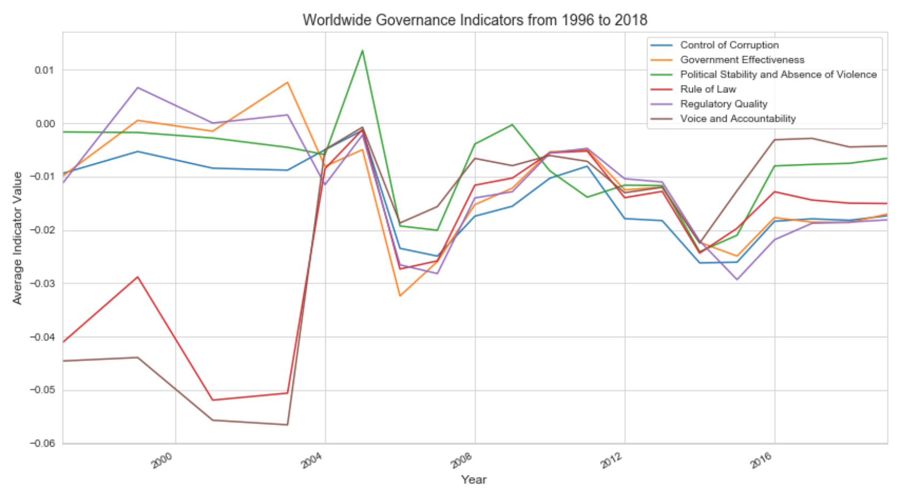
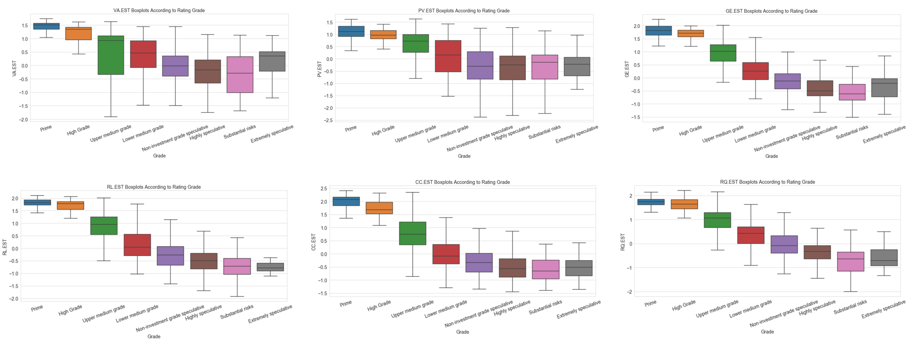
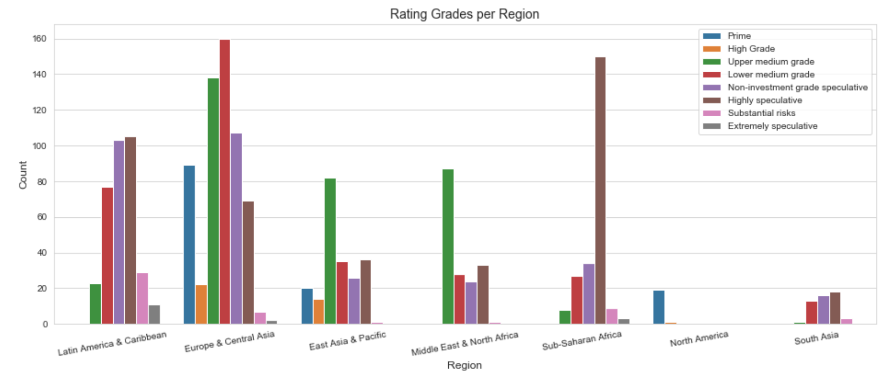
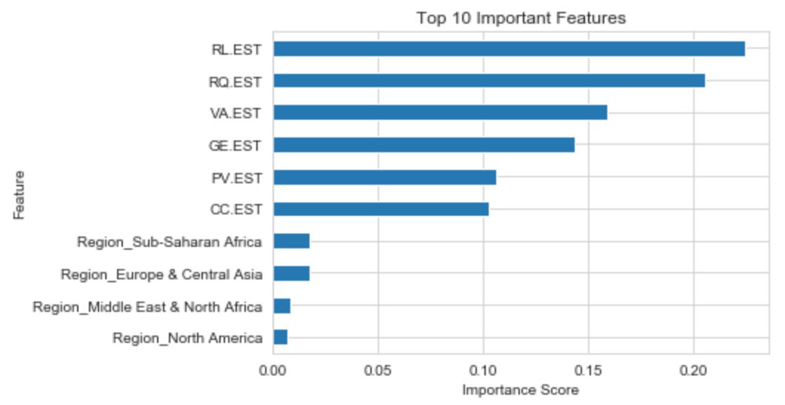
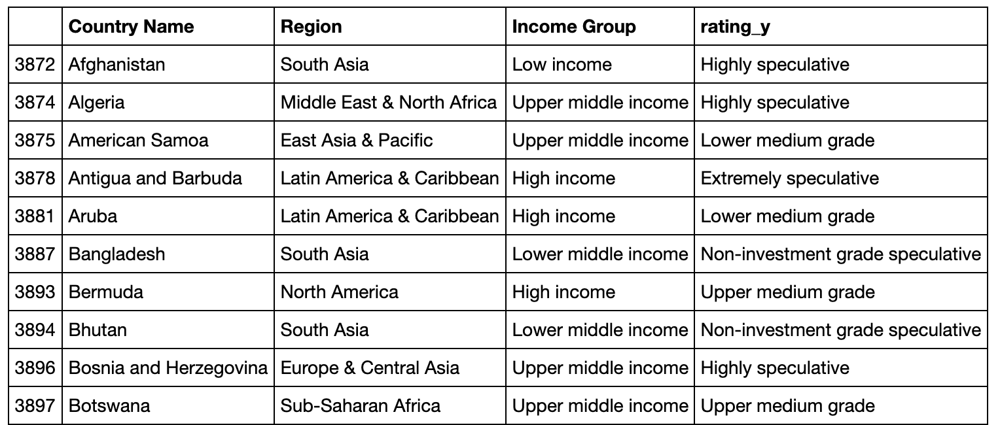

# Predicting Risk of Default using Worldwide Governance Indicators (WGI)
## Motivation
I had the opportunity to attend a hackathon organized by The World Bank to explore new ways of extracting valuable insight from their data that would contribute towards their mission. The World Bank's mission is "to achieve the twin goals of ending extreme poverty and building shared prosperity".  

The World Bank like any other banking institution has limited resources, and the efficient allocation of these resources is crucial to achieving the bank's goals. With various countries competing for financing options to improve their countries, how do we choose go gets the resources they need?  

In this project, I look into country governance indicators and how they impact the country's risk of default as rated by independent sovereign debt credit agency's. The main question to be answered is, how are government indicators associated with risk of default?
## Non-Technical Presentation
Click on the following image to be redirected to the presentation hosted on youtube.

## Process Overview

## Data Sources
### The World Bank's DataBank

Aggregate and individual governance indicators for the six dimensions of governance: Voice and Accountability; Political Stability and Absence of Violence/Terrorism; Government Effectiveness; Regulatory Quality; Rule of Law; Control of Corruption.
Access the database by following [this link.](https://databank.worldbank.org/source/worldwide-governance-indicators)

### Countryeconomy.com
A sovereign credit rating is the credit rating of a sovereign entity, such as a national government. The sovereign credit rating indicates the risk level of the investing environment of a country and is used by investors when looking to invest in particular jurisdictions, and also takes into account political risk([Wikipedia](https://en.wikipedia.org/wiki/Credit_rating)).
Access the website following [this link.](https://countryeconomy.com/ratings)

## Data Insights
### Worldwide Governance Indicators Through Time

The World Bank developed The Worldwide Governance Indicators in 1996, this is when the highest values for most indicators with average values close to 0, except for 'RL.EST' and 'VA.EST', Rule of Law and Voice and Accountability respectively, which started with the lowest observed values. They converge around the year 2004 and shortly after that, they all together decrease drastically around the year 2006. In more recent years, from 2016 onwards, the indicators show reduced volatility and more stable average values.
### Worldwide Governance Indicators Controlled by Investment Grade Category

When controlling and ordering the Worldwide Governance Indicators for the investment grade category according to the level of risk, we can notice a decreasing trend for all indicator values. This could mean that there is an association between the level of risk and indicator values, where the lower the risk the higher the values for all governance indicators. Governance indicators and risk are inversely related.
### Regional Distribution of Investment Grade Categories

There are only 3 regions with prime rating grades, North America, Europe, and Central Asia, and East Asia Pacific. Sub-Saharan Africa has the most highly speculative rating grades of all regions. South Asia is mostly awarded lower medium grades downward. Additionally, Latin America and the Caribbean is the region with the most extremely speculative grades received.

## The Model
I trained 3 non-parametric classification models, K-NearestNeighbors, RandomForest, GradientBoosting. I chose non-parametric models because the worldwide governance indicators are non-normally distributed. I want to keep the explainability of the models simple, hence I opted not to transform the data to make it more normal. I developed a pipeline to tune the hyper-parameters for the three models with a 5-fold cross-validation GridSearch, optimizing for precision. Precision is a relevant metric in this project because it answers the following question: What proportion of the predicted investment grade classes are correctly predicted? The World Bank relies on this precision because it has to offer competitive loan terms for all levels of risk. The results are shown in the following table:

| model            | accuracy | precision | recall | f1     |
|------------------|----------|-----------|--------|--------|
| knn              | 65.69%   | 51.45%    | 52.28% | 51.49% |
| GradientBoosting | 66.91%   | 49.97%    | 50.25% | 49.98% |
| RandomForest     | 54.41%   | 42.37%    | 41.42% | 41.32% |

The best performing model is K-Nearest Neighbors with a precision of a little over 51% and an accuracy of almost 66%. We can see from the table that it's recall score of 52% also outperformed the other models. Gradient Boosting was a close second, although its accuracy of almost 67% surpasses that of K-NN. Since K-NN does not have a feature importance method, I chose to use GradientBoosting's feature importance method as seen in the following image:

Since no transformations were applied to the data, the interpretability of this plot is very intuitive. We can see that the most important feature in the model is Rule of Law, followed by Regulatory Quality. The least important governance indicator was Control of Corruption. This is surprising given the worldwide importance given to this issue. 

## Predictions
Out of the 205 countries included in the Worldwide Governance Indicators for the year of 2018, 81 countries did not receive a sovereign credit rating. I used the model to predict their investment grade class should they have received a credit rating. Here is a sample containing 10 of those countries (the prediction is in the column 'rating_y'):

## Conclusion and Recommendations
I have developed a KNearestNeighbors Classification model that has 51% precision and 65% accuracy scores. The metrics are significant given that there are 8 different classes and the most recurring one only had about 25% incidence.

This model does not substitute for due diligence or more complete current models. This model could be thought of as a feature engineering tool to be used during preprocessing to develop a new feature, in this case, the rating grade, and use it to increase the more robust model's performance.

